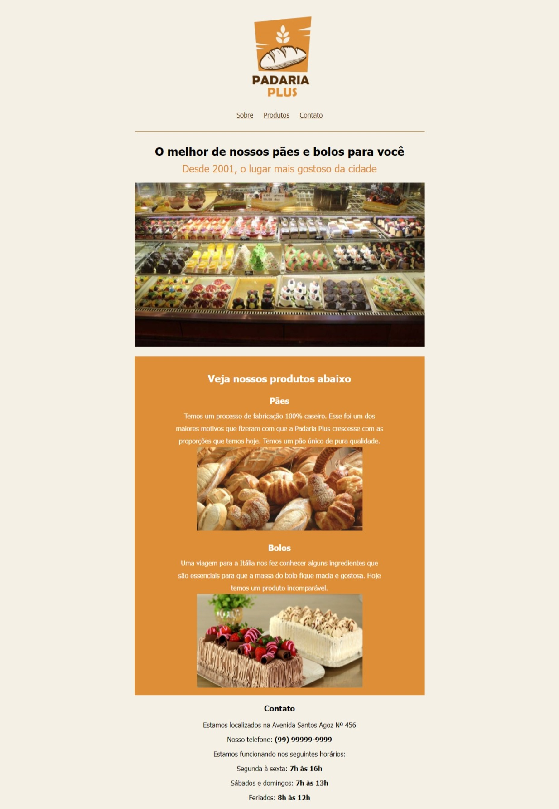

# 🚀 Página Padaria Plus
Esse projeto foi proposto no Guia de CSS da DevMedia

## 🚀 Preview

## 🚀 Sobre o Projeto
O projeto proposto foi a construção de um site de divulgação para uma padaria fictícia chamada Padaria Plus, que contém um pequeno resumo sobre a padaria e uma prévia de alguns de seus produtos

## 🚀 Tecnologias utilizadas
O projeto foi feito com as seguintes tecnologias
- HTML para a estrutura do site
- CSS para a estilização do visual